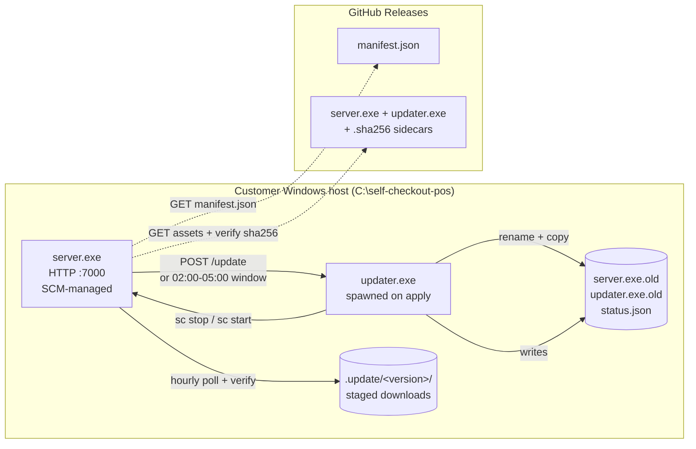
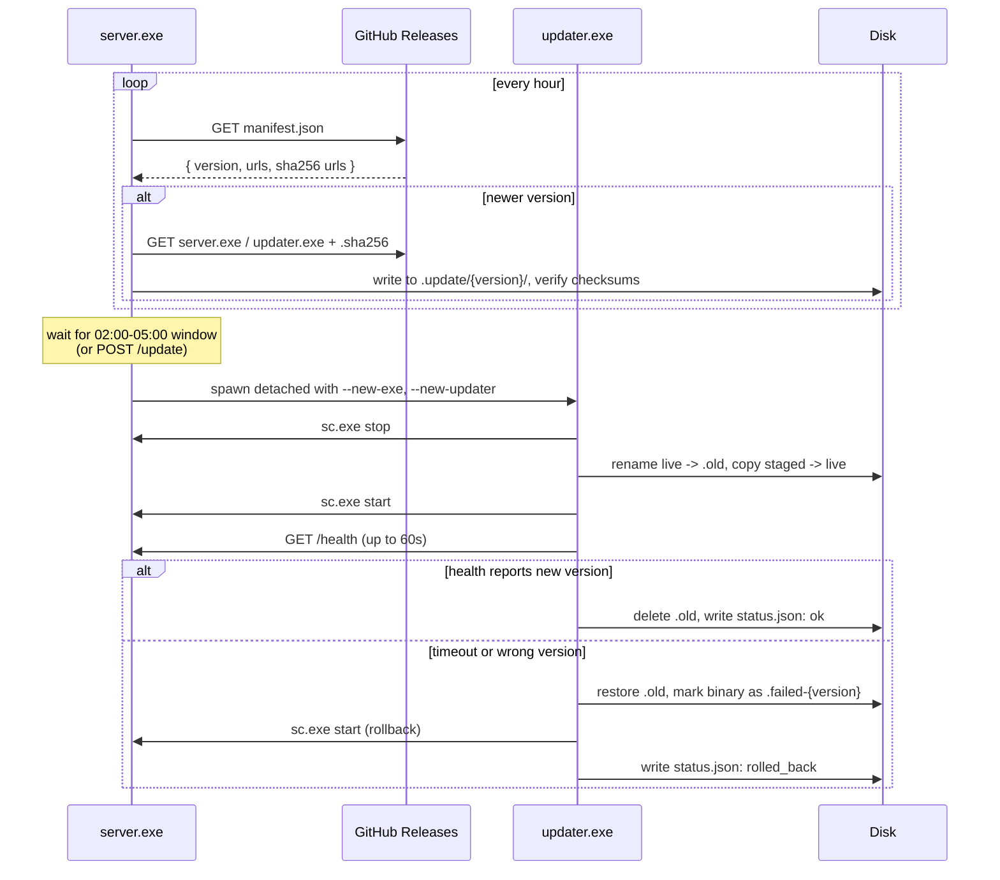
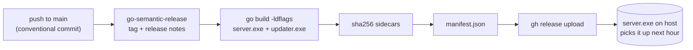

# self-checkout-pos

Wails v2 desktop app for self-checkout terminals. The Go process embeds the existing HTTP service (`internal/server`) and the auto-updater (`internal/updater`); the UI is a React + Vite + TanStack Router SPA bundled into the same binary.

`cmd/server` and `cmd/updater` remain as headless dev/CI tooling. Production ships the Wails binary plus `updater.exe`, and the same self-update flow that was originally built for the service is reused to swap the desktop binary.

## Desktop app (Wails)

Prereqs: Go 1.22+, Node 20+, pnpm 10+, plus the Wails CLI (`go install github.com/wailsapp/wails/v2/cmd/wails@latest`). Run `wails doctor` to verify.

Common commands (run from repo root):

```bash
wails dev      # hot-reload dev window (Go + Vite)
wails build    # production binary at build/bin/
wails generate module   # regenerate frontend bindings only
```

Layout:

```
.
├── main.go / app.go         # Wails bootstrap + App facade (Bind target)
├── frontend/                # React + Vite + TanStack Router + Tailwind v4 + shadcn/ui
│   ├── src/
│   │   ├── routes/          # file-based routes (routeTree.gen.ts auto-generated)
│   │   ├── features/        # feature-scoped modules
│   │   ├── components/ui/   # shadcn primitives
│   │   ├── lib/utils.ts     # cn() helper
│   │   ├── styles.css       # Tailwind v4 entry
│   │   └── wailsjs/         # generated bindings (gitignored)
│   └── dist/                # vite build output (gitignored)
├── internal/
│   ├── app/                 # future Wails-facing controllers
│   ├── db/                  # SQLite (modernc.org/sqlite) + goose migrations
│   ├── domain/              # entities, business rules (no Wails imports)
│   ├── services/            # use cases
│   ├── repositories/        # data access
│   ├── events/              # event constants for runtime.EventsEmit
│   └── platform/            # OS abstractions via build tags
└── build/                   # Wails packaging assets (appicon, info.plist, etc.)
```

The SQLite database lives at `$XDG_CONFIG_HOME/self-checkout-pos/data.db` (`~/Library/Application Support/...` on macOS, `%APPDATA%\...` on Windows).

The embedded HTTP server still listens on `:7000` so existing integrations (`/health`, `/update`, `/config`, `/hello`) keep working alongside the UI.

## Headless mode

If you only need the service (no UI, e.g. CI smoke tests or a Linux box that just runs the HTTP API), `cmd/server` still works the same way it did before Wails:

```bash
cp config.example.json config.json
POS_CONFIG=$(pwd)/config.json go run ./cmd/server -action run
curl localhost:7000/health
```

## Architecture



Windows won't let a service overwrite its own running binary. `server.exe` handles poll, download, checksum, and handoff. `updater.exe` runs detached for SCM stop, rename, copy, restart, and health check. Failed health check triggers rollback from `.old` files.

## Layout

```
.
├── cmd/
│   ├── server/main.go        # service entry point
│   └── updater/main.go       # update helper entry point
├── internal/
│   ├── applier/              # stop, swap, start, poll, rollback
│   ├── config/               # config.json loader
│   ├── server/               # HTTP server, middleware, handlers
│   ├── service/              # kardianos/service wrapper
│   └── updater/              # manifest fetch, download staging, handoff
└── .github/workflows/
    └── release.yml           # semantic-release + asset upload
```

## Build

```bash
GOOS=windows GOARCH=amd64 go build -o server.exe  ./cmd/server
GOOS=windows GOARCH=amd64 go build -o updater.exe ./cmd/updater

# Local check
go build ./...
```

CI bakes the version: `-ldflags "-X main.version=v0.1.0"`. Without it, binary identifies as `dev` and updater stays silent.

## Run locally (macOS / Linux)

```bash
cp config.example.json config.json
POS_CONFIG=$(pwd)/config.json go run ./cmd/server -action run
curl localhost:7000/health
```

Service wrapper drops to foreground outside Windows. `Ctrl+C` stops it.

## Install on Windows

1. Build both binaries with a version stamp.
2. Drop `server.exe`, `updater.exe`, and `config.json` into `C:\self-checkout-pos\`.
3. Register and start:
   ```cmd
   server.exe -action install
   server.exe -action start
   ```

Other actions: `stop`, `uninstall`, `run` (foreground).

## Configuration

`config.json` lives beside the binary. On dev machines, set `POS_CONFIG`.

```json
{
  "port": 7000,
  "api_key": "change-me",
  "auto_update_enabled": true
}
```

| Field                 | Default     | Notes                                                                        |
| --------------------- | ----------- | ---------------------------------------------------------------------------- |
| `port`                | `7000`      | HTTP listen port.                                                            |
| `api_key`             | `change-me` | Required in `X-API-Key` header (or `?api_key=` query) on auth-gated routes. |
| `auto_update_enabled` | `true`      | Kill switch for the updater poll loop.                                       |

## HTTP endpoints

| Method | Path      | Auth    | Description                                                                                                                               |
| ------ | --------- | ------- | ----------------------------------------------------------------------------------------------------------------------------------------- |
| `GET`  | `/health` | none    | `{ version, auto_update_enabled, started_at, uptime, last_poll_at, last_update }`. Updater uses this to confirm new binary booted. |
| `GET`  | `/hello`  | API key | Returns `{ message, version }`.                                                                                                           |
| `POST` | `/update` | API key | Forces immediate poll and apply, ignoring nightly window.                                                                                 |
| `POST` | `/config` | API key | Replaces `config.json` and reloads. Port changes need a service restart.                                                                  |

## Update flow



Notes:
- `dev` builds never poll.
- First boot on an older `server.exe` bootstraps a matching `updater.exe` from the release asset.
- Stage dirs for applied versions are pruned on next boot.

## Pointing the updater at a different repo

Default manifest URL:
```
https://github.com/tqrcisio/self-checkout-pos/releases/latest/download/manifest.json
```

Override at build time:
```bash
go build -ldflags \
  "-X main.version=v0.1.0 \
   -X github.com/tqrcisio/self-checkout-pos/internal/updater.DefaultReleaseRepo=youruser/yourrepo" \
  -o server.exe ./cmd/server
```

Or at runtime:
```bash
POS_RELEASE_REPO=youruser/yourrepo server.exe -action run
POS_MANIFEST_URL=https://example.com/manifest.json server.exe -action run
```

`manifest.json` shape:
```json
{
  "version":              "v0.1.0",
  "released_at":          "2026-05-18T00:00:00Z",
  "download_url":         "https://github.com/owner/repo/releases/download/v0.1.0/server.exe",
  "sha256_url":           "https://github.com/owner/repo/releases/download/v0.1.0/server.exe.sha256",
  "updater_download_url": "https://github.com/owner/repo/releases/download/v0.1.0/updater.exe",
  "updater_sha256_url":   "https://github.com/owner/repo/releases/download/v0.1.0/updater.exe.sha256"
}
```

## Release pipeline



Commit conventions:
```
feat:     minor bump
fix:      patch bump
feat!:    major bump
chore / docs / refactor:  no release
```

## Dependencies

- [`github.com/kardianos/service`](https://github.com/kardianos/service) - cross-platform service wrapper
- [`github.com/kardianos/osext`](https://github.com/kardianos/osext) - resolves executable directory

Both CGO-free.

## License

MIT. See [LICENSE](./LICENSE).
