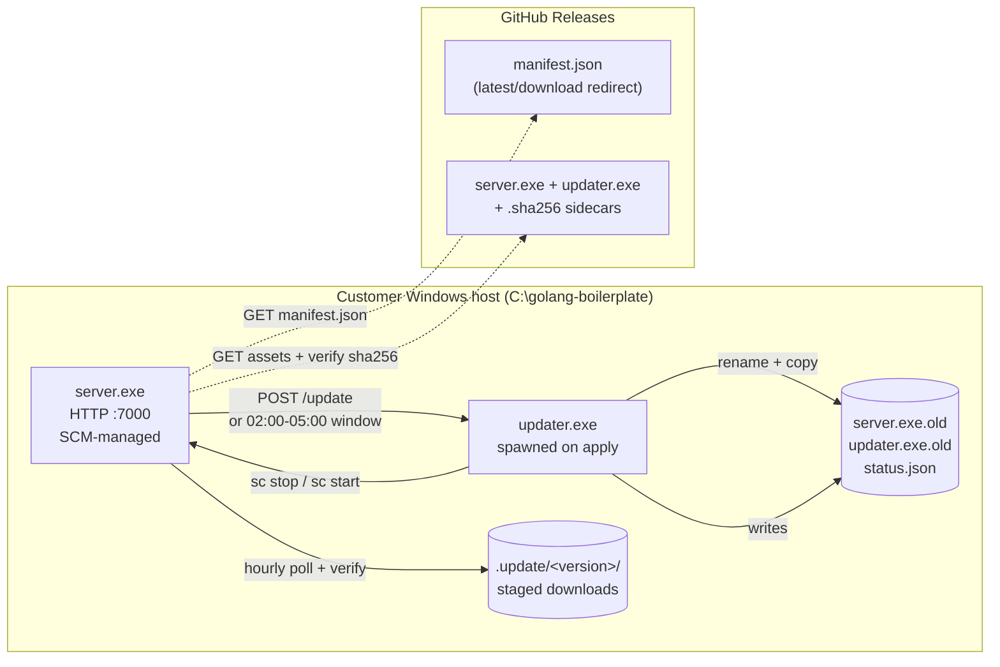
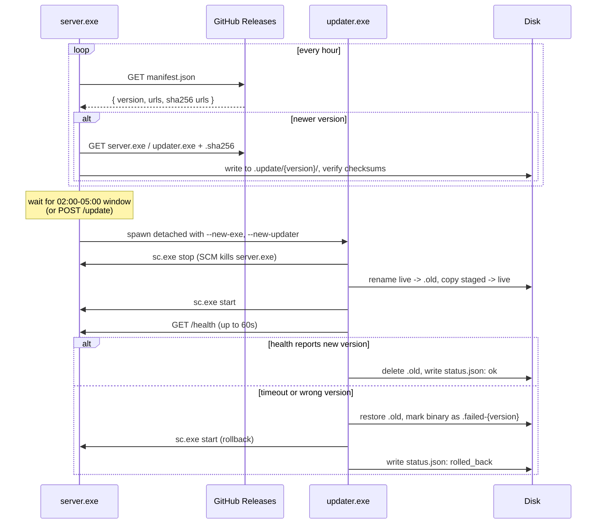
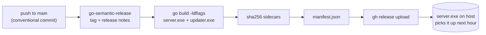

# golang-boilerplate

A Go HTTP service that runs as a Windows service and updates itself. Two
binaries sit next to each other on the host: `server.exe` polls GitHub
Releases for new versions, `updater.exe` handles the file swap and service
restart. Releases are tagged automatically from conventional commits on
`main`.

Starting point for long-running Go agents that ship to customer machines and
need to stay current without someone RDP'ing in once a month.

## Architecture



Why the split: Windows won't let a service stop itself and overwrite its own
running binary in the same step. `server.exe` handles the safe parts (poll,
download, checksum, hand off), and `updater.exe` runs detached to do the
risky parts (SCM stop, rename, copy, restart, poll health). If the new
binary fails its health check, `updater.exe` puts the `.old` files back and
records the rollback in `status.json` so the next boot can surface it.

## Layout

```
.
├── cmd/
│   ├── server/main.go        # service entry point
│   └── updater/main.go       # update helper entry point
├── internal/
│   ├── applier/              # stop, swap, start, poll, rollback
│   ├── config/               # config.json loader (next to the binary)
│   ├── server/               # HTTP server, middleware, handlers
│   ├── service/              # kardianos/service wrapper, SCM recovery
│   └── updater/              # manifest fetch, download staging, handoff
├── .github/workflows/
│   └── release.yml           # semantic-release + asset upload
├── config.example.json
└── README.md
```

## Build

```bash
# Production target
GOOS=windows GOARCH=amd64 go build -o server.exe  ./cmd/server
GOOS=windows GOARCH=amd64 go build -o updater.exe ./cmd/updater

# Local sanity check
go build ./...
```

CI bakes the version into the binary with `-ldflags "-X main.version=v0.1.0"`;
without that flag the binary identifies as `dev` and the updater stays
silent.

## Run locally (macOS / Linux)

`go run` puts the compiled binary in a temp dir, so the loader that looks
for `config.json` beside the executable comes up empty. Point it at the
file directly:

```bash
cp config.example.json config.json
BOILERPLATE_CONFIG=$(pwd)/config.json go run ./cmd/server -action run
curl localhost:7000/health
```

Outside Windows the service wrapper drops to foreground mode; `Ctrl+C`
stops it, logs go to stdout.

## Install on Windows

1. Build both binaries with a real version stamp (CI does this; see above).
2. Drop `server.exe`, `updater.exe`, and `config.json` next to each other,
   e.g. `C:\golang-boilerplate\`.
3. Register and start:
   ```cmd
   server.exe -action install
   server.exe -action start
   ```

`install` also runs `sc.exe failure` to set up Recovery Actions: three
restarts, 10 seconds apart. Other actions: `stop`, `uninstall`, `run`
(foreground for debugging).

## Configuration

`config.json` lives beside the binary on Windows. On dev machines, point
`BOILERPLATE_CONFIG` at it.

```json
{
  "port": 7000,
  "api_key": "change-me",
  "auto_update_enabled": true
}
```

| Field                 | Default     | Notes                                                                       |
| --------------------- | ----------- | --------------------------------------------------------------------------- |
| `port`                | `7000`      | HTTP listen port.                                                           |
| `api_key`             | `change-me` | Required in `X-API-Key` header (or `?api_key=` query) on auth-gated routes. |
| `auto_update_enabled` | `true`      | Kill switch for the updater poll loop. Absent means default-on.             |

## HTTP endpoints

| Method | Path      | Auth    | Description                                                                                                                              |
| ------ | --------- | ------- | ---------------------------------------------------------------------------------------------------------------------------------------- |
| `GET`  | `/health` | none    | `{ version, auto_update_enabled, started_at, uptime, last_poll_at, last_update }`. The updater uses this to confirm the new binary booted. |
| `GET`  | `/hello`  | API key | Example handler. Returns `{ message, version }`.                                                                                          |
| `POST` | `/update` | API key | Forces an immediate poll and apply, ignoring the nightly window.                                                                          |
| `POST` | `/config` | API key | Replaces `config.json` and reloads. Port changes need a service restart.                                                                  |

## Update flow



A few extra rules worth knowing:

- `dev` builds (no version ldflag) never poll. Set the ldflag if you want
  to exercise the path locally.
- If the host is running an older `server.exe` that predates this pattern,
  it bootstraps a matching `updater.exe` from the corresponding release
  asset on first boot. Auto-update stays paused until that lands.
- Stage dirs for the version that has already been applied get pruned on
  the next boot. `updater.exe` can't delete its own running file, so the
  cleanup waits for the next `server.exe` start.

## Pointing the updater at a different repo

By default the manifest URL is

```
https://github.com/tqrcisio/golang-boilerplate/releases/latest/download/manifest.json
```

For your fork, override it at build time (preferred, because the value
gets baked into the binary):

```bash
go build -ldflags \
  "-X main.version=v0.1.0 \
   -X github.com/tqrcisio/golang-boilerplate/internal/updater.DefaultReleaseRepo=youruser/yourrepo" \
  -o server.exe ./cmd/server
```

Or, for a one-off (staging, testing, switching repos at runtime):

```bash
BOILERPLATE_RELEASE_REPO=youruser/yourrepo  server.exe -action run
BOILERPLATE_MANIFEST_URL=https://example.com/manifest.json server.exe -action run
```

`manifest.json` shape (CI generates this file on every release):

```json
{
  "version":              "v0.1.0",
  "released_at":          "2026-05-18T00:00:00Z",
  "download_url":         "https://github.com/owner/repo/releases/download/v0.1.0/server.exe",
  "sha256_url":           "https://github.com/owner/repo/releases/download/v0.1.0/server.exe.sha256",
  "updater_download_url": "https://github.com/owner/repo/releases/download/v0.1.0/updater.exe",
  "updater_sha256_url":   "https://github.com/owner/repo/releases/download/v0.1.0/updater.exe.sha256"
}
```

## Release pipeline



GitHub redirects `releases/latest/download/<asset>` to the actual latest
release, so the manifest URL is stable across versions and there's no
secondary bucket to keep alive.

Commit conventions used by `go-semantic-release`:

```
feat:     new feature           -> minor bump
fix:      bug fix                -> patch bump
feat!:    breaking change        -> major bump
chore / docs / refactor:         no release
```

To cut the first release, push at least one `feat:` or `fix:` commit to
`main`. The workflow tags `v0.1.0` (or whatever semrel computes) and
uploads the assets.

## Dependencies

- [`github.com/kardianos/service`](https://github.com/kardianos/service)
  for the cross-platform service wrapper (SCM on Windows, foreground
  everywhere else).
- [`github.com/kardianos/osext`](https://github.com/kardianos/osext) for
  resolving the directory the running executable lives in.

Both are pure Go and CGO-free, which keeps the CI runner simple.

## License

MIT. See [LICENSE](./LICENSE).
